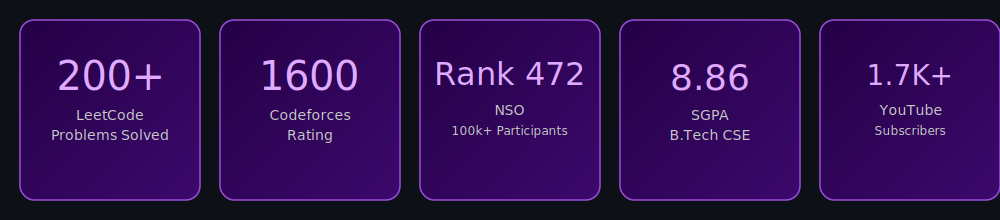

<div align="center">


<a href="https://github.com/shivamshukla02">
  
</a>


[](https://shukla02shivam-portfolio.vercel.app/)
[](https://www.linkedin.com/in/shivam-shukla-a944a13b4/)
[](mailto:shukla02shivam@gmail.com)
[](https://github.com/shivamshukla02)


</div>

---

### 🟣 About

I am a systems-focused software engineer building low-level infrastructure — storage engines, consensus protocols, and concurrent systems designed for correctness under load. Built a custom LSM-Tree storage engine in Java 17 hitting >504K random writes/sec (≈78% of RocksDB throughput) and cutting p99 read latency from 800µs to 97µs. Currently architecting Raftstore, a linearizable distributed KV store on Raft consensus over gRPC (TLS), sustaining >50K write ops/sec at p99 < 5ms.

My focus areas:
- **Storage Engines** — write-ahead logging, skip-list memtables, leveled compaction, Bloom-filtered SSTables
- **Distributed Systems** — Raft consensus, MVCC with Lamport timestamps, linearizability, chaos testing
- **Concurrency & Performance** — correctness-first engineering over shipping velocity
- **Competitive Programming** — 200+ problems on LeetCode, Codeforces rating 1600

**Open To:** Internships and full-time roles in Systems Engineering, Backend Infrastructure, and Distributed Systems at companies that value engineering correctness — Google, Cloudflare, CockroachDB, and top-tier HFT firms (Jane Street, HRT, Optiver, IMC, Tower Research).

---

### 🟣 Tech Stack

**Languages**
   

**Frameworks**
   

**Libraries**
    

**Developer Tools**
     

**Core Concepts**
`Data Structures & Algorithms` `Operating Systems` `DBMS` `Multithreading` `Consensus Algorithms` `System Design` `Storage Engines` `Concurrency` `Distributed Systems`

---

### 🟣 Applied AI Work (Hackathons)

| Domain | Proficiency | Details |
|---|---|---|
| Multi-Agent Systems | Intermediate | Agentic kill-chain reconstruction pipelines — ThreatWeaver (Splunk Agentic Ops Hackathon) |
| Offline LLM Tooling | Intermediate | Gemma 4, Ollama, ChromaDB, Whisper, IndicTrans2 — Sahayak AI (Kaggle Gemma 4 Good Hackathon) |
| RAG Pipelines | Working Knowledge | ChromaDB-backed retrieval for offline emergency-response assistant |
| Speech & Translation | Working Knowledge | Whisper for ASR, IndicTrans2 for multilingual translation |

---

### 🟣 Featured Projects

<details>
<summary><b>LSM-Tree Storage Engine with MVCC — Database Internals</b></summary>

*June 2026 – Aug 2026*

High-performance LSM-tree storage engine built in Java 17 for real-time analytics workloads, implementing the core mechanics used in production systems like RocksDB and Cassandra.

| Stack | Scale | Performance | Security | Impact | Repository |
|---|---|---|---|---|---|
| Java 17, YCSB, Prometheus, WAL, Compaction | Single-node, extensible | >504K random writes/sec (≈78% of RocksDB), p99 read latency 800µs → 97µs | Crash-safe via WAL replay | Eliminated >90% SSTable reads under read-heavy workloads | [GitHub](https://github.com/shivamshukla02) |

Engineered a skip-list MemTable, leveled compaction pipeline, and Bloom-filtered SSTables (k=7, 10 bits/key). Integrated a sharded LRU block cache, group-commit WAL batching, and adaptive compaction throttling, holding space amplification at 1.4×.

</details>

<details>
<summary><b>Raftstore — Distributed Key-Value Store</b></summary>

*Sep 2026 – Dec 2026*

Linearizable distributed key-value store using Raft consensus over gRPC (TLS), built for correctness under concurrent load and node failure.

| Stack | Scale | Performance | Security | Impact | Repository |
|---|---|---|---|---|---|
| Java 17, Raft, gRPC, MVCC, WAL | Multi-node cluster | >50K write ops/sec, p99 write latency < 5ms, lease reads <1ms, >200K reads/sec | TLS-secured transport, fencing tokens | Validated via chaos testing for crash safety | [GitHub](https://github.com/shivamshukla02) |

Built lease-based reads via leader-local serving with monotonic-clock validation, and an MVCC state machine using Lamport timestamps with snapshot isolation and background GC to control space amplification.

</details>

<details>
<summary><b>Sahayak AI — Offline Multilingual Emergency Assistant</b></summary>

Offline-first multilingual AI assistant for emergency response scenarios, built for the Kaggle Gemma 4 Good Hackathon.

| Stack | Scale | Performance | Security | Impact | Repository |
|---|---|---|---|---|---|
| Gemma 4, Ollama, FastAPI, ChromaDB, Whisper, IndicTrans2, Flutter | Offline single-device | Low-latency local inference | Fully offline, no data transmission | Hackathon submission | [GitHub](https://github.com/shivamshukla02) |

Combines local LLM inference with speech recognition and multilingual translation to deliver emergency guidance without internet connectivity.

</details>

<details>
<summary><b>ThreatWeaver — Multi-Agent APT Kill Chain Reconstruction</b></summary>

Multi-agent system for reconstructing advanced persistent threat (APT) kill chains, built for the Splunk Agentic Ops Hackathon.

| Stack | Scale | Performance | Security | Impact | Repository |
|---|---|---|---|---|---|
| Multi-agent orchestration, Splunk | Log-scale analysis | Automated chain reconstruction | Security-focused by design | Hackathon submission | [GitHub](https://github.com/shivamshukla02) |

Uses coordinated agents to trace and reconstruct attacker behavior across the kill chain from raw security event data.

</details>

<details>
<summary><b>MediVerse-X — AR Surgical Planning Platform</b></summary>

Augmented reality platform for surgical planning, built for the Mercer|Mettl VISIONARY Hackathon 2.0.

| Stack | Scale | Performance | Security | Impact | Repository |
|---|---|---|---|---|---|
| AR/VR tooling, full-stack | Single-surgeon workflow | Real-time visualization | Standard app-level security | Hackathon submission | [GitHub](https://github.com/shivamshukla02) |

Enables pre-operative visualization and planning through augmented reality overlays.

</details>

<details>
<summary><b>Commbank Program — Full-Stack Banking Application</b></summary>

Full-stack banking simulation application with a C# .NET backend, TypeScript frontend, and full unit test coverage.

| Stack | Scale | Performance | Security | Impact | Repository |
|---|---|---|---|---|---|
| C# .NET, TypeScript, MSTest | Full-stack application | Unit-tested backend logic | Standard banking app practices | Professional simulation project | [GitHub](https://github.com/shivamshukla02) |

Built with complete unit test coverage using MSTest to validate backend banking logic.

</details>

---

### 🟣 Experience

**Campus Technical Partner — Internshala**
*Aug 2025 – Nov 2025*

Worked as a technical partner driving student outreach and engineering education on campus.

- Created and deployed a resume-analysis tool used by 100+ students
- Led technical sessions for a 200+ student cohort on software engineering fundamentals, resume reviews, and internship prep
- Received a Letter of Recommendation from Internshala for contributions to student outreach and technical mentoring

`Technical Mentoring` `Resume Tooling` `Community Outreach`

---

### 🟣 Achievements

<div align="center">

| Recognition | Details |
|---|---|
| Competitive Programming | 200+ problems solved on LeetCode, active on Codeforces (Rating: 1600) |
| National Science Olympiad (NSO) | International Rank 472 among 100,000+ participants worldwide |
| Content Creation | YouTube channel with 1,700+ subscribers and 600,000+ views |
| SGPA 8.86 | B.Tech CSE, PSIT Kanpur |
| Internshala Letter of Recommendation | For student outreach and technical mentoring contributions |

</div>

---

### 🟣 Coding Profiles

<div align="center">

[](https://leetcode.com/u/shivam_shukla_02)
[](https://codeforces.com/profile/shivam_shukla_02)
[](https://www.hackerrank.com/profile/shukla02shivam)

</div>

---

### 🟣 GitHub Analytics

<div align="center">


</div>

---

### 🟣 GitHub Trophies

<div align="center">



</div>

---

### 🟣 Contribution Activity

<div align="center">


</div>

---


### 🟣 Current Focus

```yaml
learning:
  - Distributed Systems (Raft Consensus, MVCC)
  - Advanced DSA & Competitive Programming
  - GATE CS 2028 Preparation

building:
  - LSM-Tree Storage Engine (Java)
  - Raftstore Distributed KV Store (Raft + gRPC + TLS)

exploring:
  - Compaction Strategies in Storage Engines
  - GSoC 2027 Contribution Opportunities

open_to:
  - Systems Engineering Internships
  - Backend Infrastructure Roles
  - HFT & Low-Latency Systems Roles
```

---

### 🟣 Connect

<div align="center">

[](mailto:contact@example.com)
[](https://www.linkedin.com/in/shivam-shukla-a944a13b4/)
[](https://github.com/shivamshukla02)
[](https://shukla02shivam-portfolio.vercel.app/)

</div>

---

<div align="center">

*"Correctness is not negotiable — velocity without it is just fast failure."*


</div>
